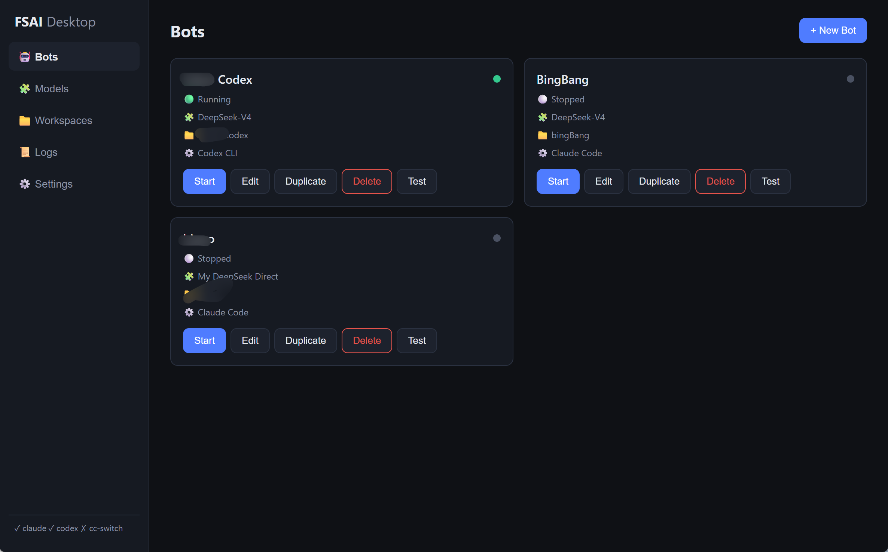

# FSAI Desktop

> 飞书 AI Bot 桌面启动器 —— 把 **飞书 + 模型 + Claude Code/Codex + 本地目录** 粘成一个工具，配一次就能在飞书里 `@机器人` 调度本地 AI 编程助手。

[](https://github.com/Rbingo/fsai-desktop/releases)

## 这是什么

还在手动维护一堆东西吗？飞书 App ID/Secret、模型 API Key、Base URL、工作目录、终端进程……多开几个 Bot（代码助手用 DeepSeek、代码审查用 Claude）更是乱成一团，Provider 互相覆盖、配置冲突、换电脑就得重来。

FSAI Desktop 把它们收进一个桌面 GUI：

```
配一次 Bot → 选一个模型 → 选一个目录 → 点启动 → 飞书里 @机器人 对话
```



## 核心特性

- **Bot ≠ 模型**：Bot 和模型解耦，随时换模型，不用重建配置
- **复用 cc-switch**：自动读取你 cc-switch 里配好的 Provider，不重复填 Key（支持 Claude Code 和 Codex CLI 两种 Runtime）
- **Runtime 隔离**：每个 Bot 独立 HOME，多 Bot 同时跑互不影响
- **飞书长连接**：本地开发无需公网、无需内网穿透
- **Secret 脱敏**：App Secret / API Key 在日志和界面里自动打码

## 下载

👉 [**下载 Windows 版（免安装，双击即用）**](https://github.com/Rbingo/fsai-desktop/releases/latest)

> 当前仅 Windows x64。首次运行若 Windows SmartScreen 提示「未知发布者」，点「更多信息 → 仍要运行」即可（应用尚未做代码签名）。

## 快速上手（3 步）

### 前置条件

- 已安装 [Claude Code](https://docs.anthropic.com/claude-code)（`claude` 命令可用且已登录）或 [Codex CLI](https://github.com/openai/codex)
- （可选）已安装 [cc-switch](https://github.com/aravhawk/cc-switch) 并配置好模型 Provider。没有 cc-switch 也可以用内置的 Direct API 直接填 Key

### 第 1 步：创建飞书机器人

这是唯一需要「折腾」的一步，之后一劳永逸：

1. 打开 [飞书开放平台](https://open.feishu.cn)，登录后进入「开发者后台」
2. 创建「**企业自建应用**」，起个名字（如「我的代码助手」）
3. 复制 **App ID** 和 **App Secret**（在「凭证与基础信息」页）
4. 左侧「**事件与回调**」→「事件订阅」→ 订阅方式选「**使用长连接接收事件**」
5. 在下方「事件」里添加：**`接收消息 im.message.receive_v1`**
6. 左侧「**添加应用能力**」→ 开启「**机器人**」能力
7. 发布版本（开发者后台右上角「创建版本并发布」，选自己可见即可）

> ⚠️ 每个飞书应用只能被一个 Bot 使用（长连接是集群模式，同一 App 多客户端会随机抢消息）。多个 Bot 请各建各的飞书应用。

### 第 2 步：添加工作目录和模型

- **Workspaces** 页 → `+ Add Workspace` → 起个逻辑名 + 选本地项目目录
- **Models** 页 → 确认 cc-switch 状态（本机没装就直接加一个 Direct API Profile）

### 第 3 步：创建并启动 Bot

- **Bots** 页 → `+ New Bot`：
  - Bot 名（随便起）
  - 飞书 App ID / App Secret（第 1 步拿到的）
  - Runtime：`Claude Code` 或 `Codex CLI`
  - Model Source：`cc-switch`（选 Profile）或 `Direct API`（选你建的）
  - Workspace（第 2 步建的）
- 点 **Save**，再点 **Start**
- 在飞书里找到你的机器人，`@机器人 你好` 发条消息，几秒后就会收到回复

---

## 开发者

### 本地开发

```bash
pnpm install
pnpm start     # 启动
pnpm smoke     # 冒烟测试
pnpm dist      # 打包 Windows exe
```

环境：Node.js ≥ 20、pnpm。

### 目录结构

```
main.js                 Electron 主进程
preload.js              contextBridge IPC 桥
src/
  models.js             数据模型
  store.js              JSON 配置存储
  logger.js             日志 + Secret 脱敏
  doctor.js             环境检测 + .cmd shim 解析
  cc-switch.js          cc-switch SQLite 解析（claude/codex）
  model-resolver.js     模型解析（cc-switch / direct）
  runtime-manager.js    隔离 Runtime + claude/codex 执行
  feishu-adapter.js     飞书长连接
  bot-manager.js        Bot 生命周期编排
renderer/               单页 5 页面 UI
scripts/smoke.js        冒烟测试
```

### 技术栈

Electron + 原生 Node（无框架），飞书官方 `@larksuiteoapi/node-sdk` 长连接，`node:sqlite` 读 cc-switch 数据库。

### MVP 边界（已知未实现）

- 系统托盘、开机自启、最小化到托盘（UI 有开关占位，主进程未接）
- 同一 Bot 单条消息串行处理
- 飞书长连接 3 秒超时内未完成的请求，需后续改「先回执 + 异步回复」
- cc-switch 各 fork 存储格式差异较大，解析做了容错，按需调优

## License

MIT
